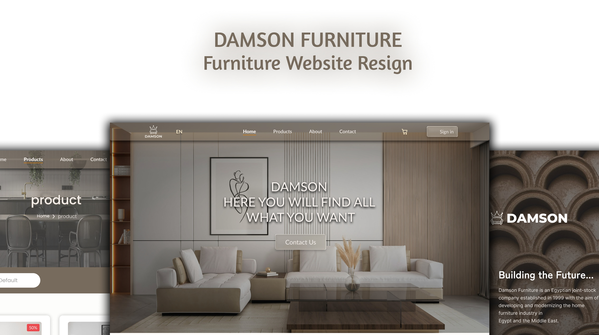

# Damson Furniture Website Redesign
Human Computer Interaction (HCI) Project

# 📌 Project Overview

This project is part of the Human Computer Interaction (HCI) course.
The goal of this project is to analyze a poorly designed website interface and redesign it to improve usability, user experience (UX), and user interface (UI) based on HCI principles.

The selected case study is the Damson Furniture Website, which suffers from multiple UI and UX issues that negatively affect user interaction and satisfaction.

# 🌐 Original Website

🔗 https://www.damsonfurniture.com

# 🔗  Redsign Prototype Link

Figma prototype:

https://figma.com/design/ISYLn5bW117aXdjMQsGMDj/damson-11111?node-id=0-1&t=vSbtMo75Rhkai4iI-1

view link:

https://www.figma.com/proto/ISYLn5bW117aXdjMQsGMDj/damson-11111?node-id=0-1&p=f&t=bxWAYZaf20Lci0qj-0&scaling=min-zoom&content-scaling=fixed&page-id=0%3A1&starting-point-node-id=1%3A2

# 🎯 Project Objectives

- Identify UI and UX problems in the original website
- Apply HCI principles to improve usability
- Redesign the website interface with a modern and clean UI
- Enhance navigation, readability, and user flow
- Compare the old design with the new redesign

# 👥 Target Users

Users interested in buying home furniture online  
Adults aged 25–55  
Users who prefer easy navigation and clear product information

# ⚠️ Problems in the Original Design

UI Issues
- Poor visual hierarchy
- Inconsistent colors and typography
- Cluttered layout
- Weak contrast and readability
- Unclear call-to-action buttons

 UX Issues
- Confusing navigation structure
- Poor product categorization
- Difficult search and filtering
- Lack of feedback and guidance
- Low overall usability

# 📐 HCI Principles Applied

- Visibility of system status
- Consistency and standards
- User control and freedom
- Error prevention
- Aesthetic and minimalist design
- Recognition rather than recall

# 🎨 Redesign Approach

- Simplifying the layout
- Improving visual hierarchy
- Using consistent color schemes and typography
- Enhancing navigation and user flow
- Making important actions clear and accessible

# 🖥️ Old vs New Design Comparison

UI Comparison
- Layout: Cluttered → Clean & structured
- Colors: Inconsistent → Consistent palette
- Typography: Hard to read → Clear & readable
- Buttons: Unclear → Clear CTA buttons

UX Comparison
- Navigation: Confusing → Simple & clear
- Usability: Low → High
- Learnability: Difficult → Easy
- User Flow: Interrupted → Smooth

 Accessibility Improvements

- Improved color contrast
- Better font sizes and spacing
- Clear labels and buttons
- Easier navigation for all users

 # 📈 Results & Impact

- Improved user experience
- Faster task completion
- Reduced user confusion
- More professional and trustworthy appearance

# 🚀 Technologies & Tools Used

- Figma (UI/UX Design & Prototyping)
- GitHub (Project Hosting)

# 📂 Project Structure
/damson-hci-redesign
│
├── old-design/
│   └── screenshots
│
├── new-design/
│   └── screenshots
│
├── presentation/
│   └── HCI_Presentation.pdf
│
├── prototype/
│   └── figma-link.txt
│
└── README.md

# 🧠 Key Learnings

Understanding real user problems is essential  
HCI principles greatly improve usability  
UI and UX must work together to create effective designs

# 📌 Conclusion

This project demonstrates how applying Human Computer Interaction principles can significantly improve a poorly designed website, resulting in a more usable, accessible, and user-friendly interface.
# 📌 PROJECT
 
Course: Human Computer Interaction  
University: Tanta University  
Year: 2025
Under Supervision:
Dr/ Osama Ghoneim
Eng/ Omar Khaled

team :
Wessam Mohammed Elsayed Alhanafy

Heba Ahmed Ibrahim Agamy

Menna Ahmed Ibrahim Agamy
